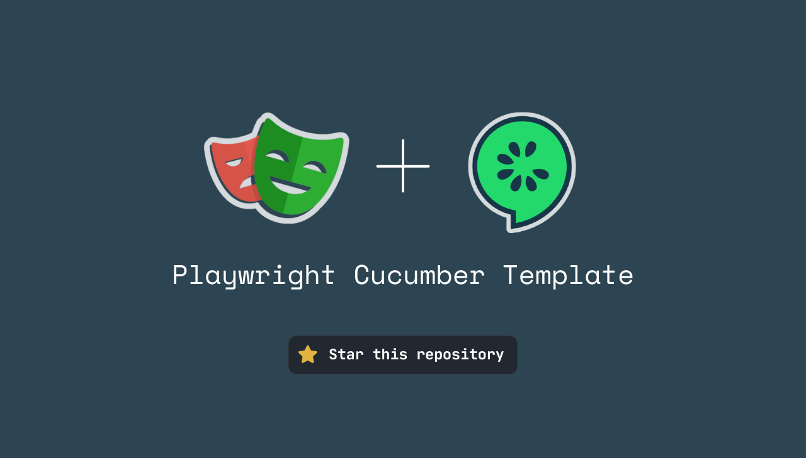

# End-to-End Testing introduction

---

---

# Introduction

This document serves as a comprehensive guide for setting up, running, and contributing to the end-to-end testing framework for the `web-app/client` project.

> 💡 For insights into overarching testing principles, see the [Testing Principles](https://www.notion.so/tools/Testing-principles-8b1b624694f04aebaaebb4c1cec73538?pvs=4) document.

---

# Table of Contents

- [Testing Overview](./1-e2e-overview.md#testing-overview)  
  An explanation of the tools and architecture used for end-to-end testing in this project.

- [Running Tests Locally](./2-how-to-run-e2e-tests.md)  
  Instructions for preparing your environment and running the test suite.

- [Writing Tests](./3-how-to-write-e2e-tests.md)  
  Best practices and steps for creating end-to-end tests using Playwright and Cucumber.

- [Contributing to Utilities](./4-how-to-contribute-to-e2e-utils.md)  
  Guidelines for adding or improving utilities shared across tests.

- [Setup your own configuration](./5-how-to-setup-your-own-configuration.md)  
  Instructions for setting up your own web-app configuration for the end-to-end tests.

- [Utility Reference](./6-list-of-e2e-utils)  
  A catalog of reusable utilities, with usage examples and
