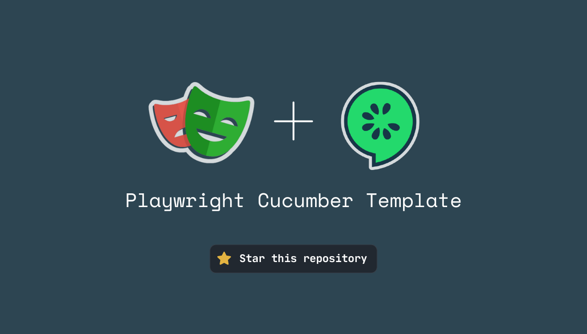

# List of E2E utils

---



---

## 📚 Introduction

This reference guide lists and describes all the end-to-end testing common utils of this e2e testing stack.

## Utils

Utils are categorized in 2 main categories:

- [Steps](#steps)
- [Fixtures](#fixtures)

## Fixtures

Fixtures are used to prepare the test environment before running the tests.

Full list of available fixtures:

- [localStorage](#1-localstorage)
- [sessionStorage](#2-sessionstorage)
- [clipboard](#3-clipboard)

#### 1. `localStorage`

_Located in `src/utils/fixtures/localStorage.fixture.ts`_

It provides a fixture to manage the local storage of the browser.
You can use this fixture directly in your step using :

```typescript
Given('I have a new account', async ({ localStorage }) => {
  await localStorage
    .setItem('token', 'my-token')
    .setItem('user', { name: 'Jane Doe' });
});

Then('I should see the user name', async ({ localStorage }) => {
  const user = await localStorage.getItem('user');
  expect(user.name).toBe('Jane Doe');
});
```

See [localStorage.fixture.ts](../src/utils/fixtures/localStorage.fixture.ts) for more details about all the available methods.

#### 2. `sessionStorage`

_Located in `src/utils/fixtures/sessionStorage.fixture.ts`_

It provides a fixture to manage the session storage of the browser.
You can use this fixture directly in your step using :

```typescript
Given('I have a new account', async ({ sessionStorage }) => {
  await sessionStorage
    .setItem('token', 'my-token')
    .setItem('user', { name: 'John Doe' });
});

Then('I should see the user name', async ({ sessionStorage }) => {
  const user = await sessionStorage.getItem('user');
  expect(user.name).toBe('John Doe');
});
```

See [sessionStorage.fixture.ts](../src/utils/fixtures/sessionStorage.fixture.ts) for more details about all the available methods.

#### 3. `clipboard`

This fixture allows interacting with the clipboard.
You can either write to or read from it.

Here is an example on how to read the clipboard content :

```typescript
Then(
  'I should get the expected content in my clipboard',
  async ({ clipboard }) => {
    await expect(clipboard.getText()).resolves.toBe(
      'the expected clipboard content',
    );
  },
);
```

## Steps

Steps are used to interact with the application during the tests.

Full list of available steps:

- [navigation](#1-navigation)
- [interaction](#2-interaction)

#### 1. `navigation`

_Located in `src/utils/steps/navigation.steps.ts`_

It provides a set of steps to interact with the navigation of the application.
You can use this steps directly in your scenario using :

```gherkin

Scenario: Navigate to the dashboard
  Given I am on the dashboard page
```

See [navigation.steps.ts](../src/utils/steps/navigation.steps.ts) for more details about all the available steps.

#### 2. `interaction`

_Located in `src/utils/steps/interaction.steps.ts`_

It provides a set of steps to interact with the application.
You can use this steps directly in your scenario using :

```gherkin
Scenario: Click on the button
  When I click on the button "my-button"
```

See [interaction.steps.ts](../src/utils/steps/interaction.steps.ts) for more details about all the available steps.

---

### Contribution

If you want to contribute to this documentation, feel free to create a pull request on this repository
